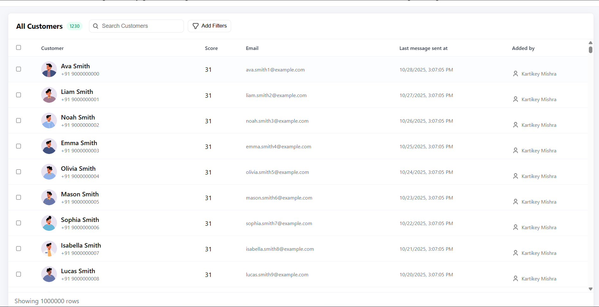
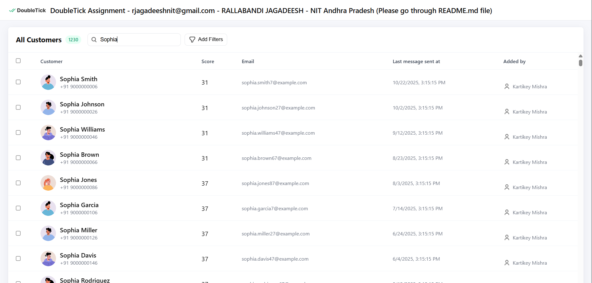
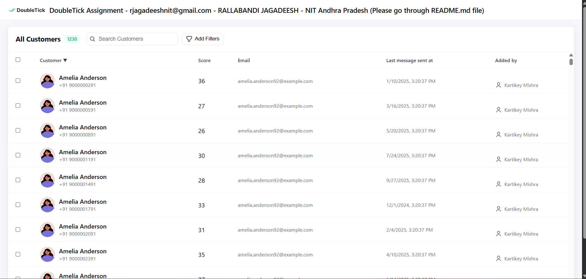
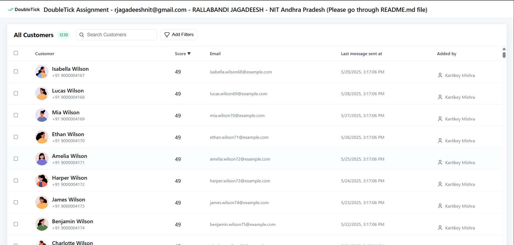
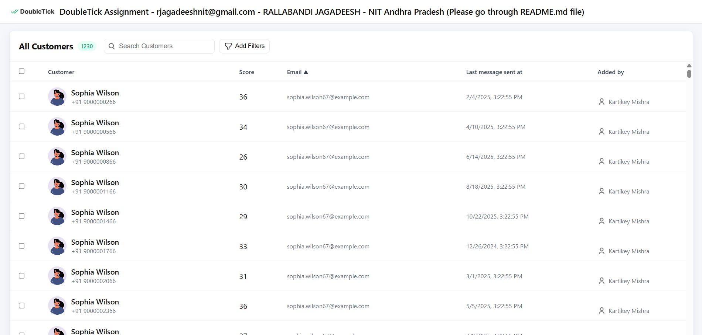
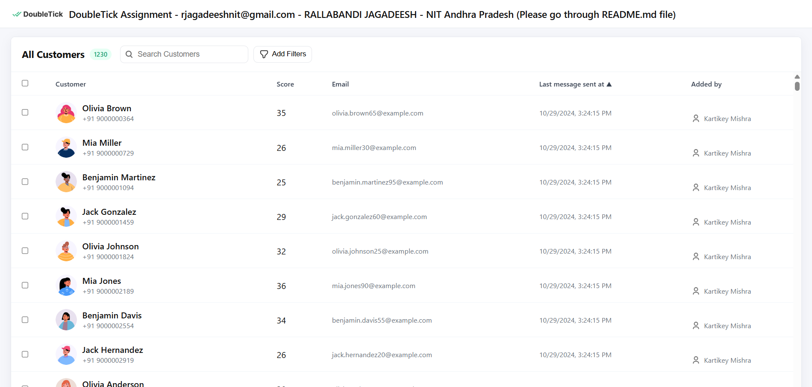
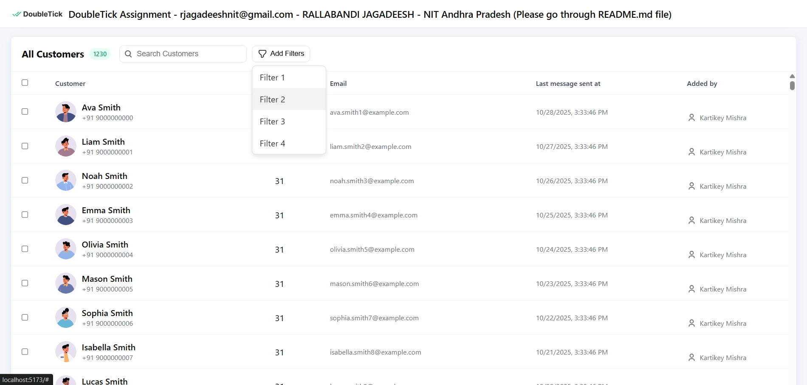
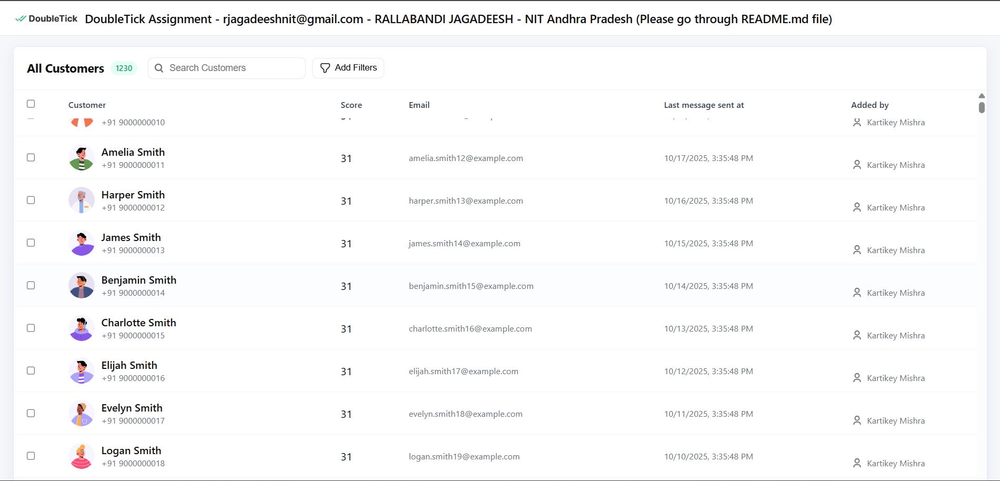

# DoubleTick Frontend Assignment – Customers List

**Author:** RALLABANDI JAGADEESH  
**Email:** rjagadeeshnit@gmail.com  
**College:** NIT Andhra Pradesh

---

## Project Overview

This is a **React-based frontend assignment** for DoubleTick. The goal is to implement a **Customers List UI** capable of handling **1 million records** efficiently with:  

- Infinite scroll (virtualized rendering)  
- Search (by name, email, or phone)  
- Sorting by column (ascending/descending)  
- Dummy filters dropdown  
- Sticky table headers  
- Smooth scrolling without UI freeze  

---

## Features & Screenshots

### 1. Large Dataset Handling
- Generates **1 million customer records** locally using deterministic pseudo-random generation.
- Uses **virtualized rendering** (renders only visible rows + buffer) to ensure smooth performance.

**Screenshot: Virtualized Table with 1M Rows**  

### 2. Search
- Debounced input search (250ms delay) for name, email, or phone.
- Offloaded search to a **Web Worker** to prevent UI blocking.

**Screenshot: Search Customers**  

### 3. Sorting
- Click on table headers to sort by **Customer, Score, Email, Last message sent at, Added by**.
- Sorting is **asc/desc toggle**.
- Offloaded sorting to Web Worker for performance.

**Screenshot: Sorting Customer**  

**Screenshot: Sorting Score**  

**Screenshot: Sorting Email**  

**Screenshot: Sorting Last message sent at**  

### 4. Filters
- Dummy dropdown filters (non-functional, UI only) for demonstration purposes.

**Screenshot: Filters Dropdown**  

### 5. Sticky Header & Hover Effects
- Table header remains **sticky** while scrolling.
- Rows have hover effect for better readability.

**Screenshot: Sticky Header & Hover**  

---

## Technical Stack

- **React 18** with **Vite**  
- **JavaScript (ESM)**  
- **Plain CSS** (no Tailwind/Bootstrap)  
- **Web Workers** for search and sort  
- Data stored in memory (no backend)  
- Responsive design for desktop/tablet  

---

## Project Structure

├── index.html # HTML entry point
├── src
│ ├── main.jsx # React DOM render
│ ├── App.jsx # Main App component with header
│ ├── components
│ │ └── CustomerTable.jsx # Customer table with infinite scroll, search, sort
│ ├── styles.css # Global CSS
│ └── assets # Icons, logos, and images
└── README.md

---

## How It Works

1. **Customer Data Generation**
   - Customers are generated using `generateCustomer(i)` based on index `i`.
   - Fields: `id`, `name`, `phone`, `email`, `score`, `lastMessageAt`, `addedBy`, `avatar`.

2. **Virtualized Table**
   - Only visible rows are rendered in the DOM for performance.
   - Scroll container calculates `visibleStart` and `visibleEnd` indices using scrollTop and row height.
   - BUFFER rows rendered above and below for smoother scroll.

3. **Web Worker**
   - Heavy computations (search & sort) run in a **separate thread**.
   - Main thread remains responsive.

4. **Search & Sort**
   - Search is **debounced** by 250ms.
   - Sorting toggles between `asc` and `desc` on column click.
   - Filtered or sorted indices are passed to visible rows calculation.

---
## Usage

1. Clone the repository:  
git clone <repository-url>
cd <project-folder>

2. Install dependencies:
npm install

3. Start development server:
npm run dev

4. Open in browser
http://localhost:5173

5. Scroll, search, and sort customers. Dummy filters dropdown works for UI demonstration.

## Performance Notes
Supports 1,000,000 records smoothly using virtualization + Web Worker.

Maximum of ~200,000 results considered in search to avoid worker overload.

Smooth scroll and sticky header remain responsive.

## Author
Rallabandi Jagadeesh
Email: rjagadeeshnit@gmail.com